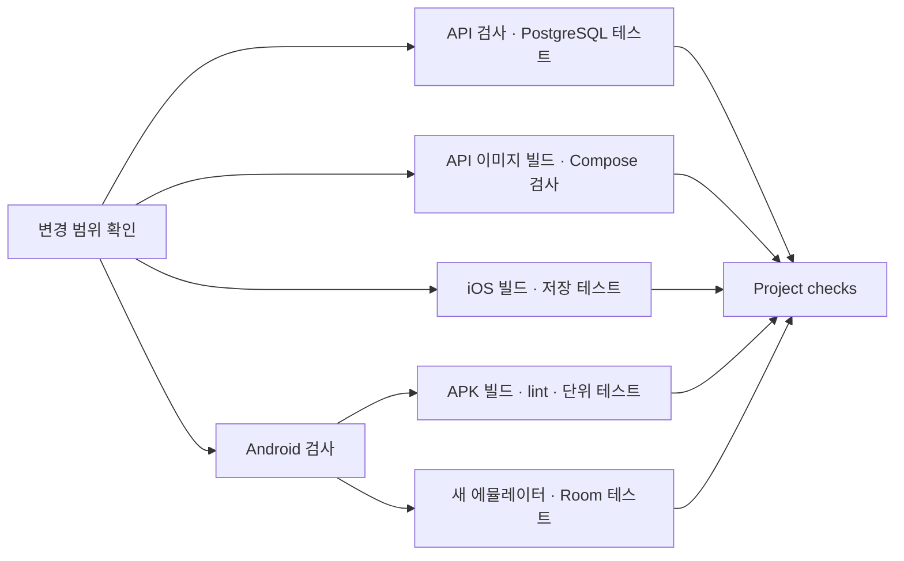

# CI 구성과 캐시

Project checks는 PR 전체 변경 범위를 기준으로 검사할 프로젝트를 선택합니다.
main push와 수동 실행도 지원합니다.
변경 이력을 확인할 수 없으면 모든 프로젝트를 검사합니다.
검사 선택기는 PR 기준 SHA 또는 main push의 before SHA에서 가져옵니다. PR이 수정한 선택기로 자신의 검사를 생략하지 않습니다.
기준 선택기가 없거나 수동 실행이면 모든 프로젝트를 검사합니다. 선택기 변경의 새 규칙은 main 반영 뒤 후속 변경부터 사용합니다.
문서만 바뀌면 Repository hygiene를 실행합니다.
기존 리뷰·PR 정책 워크플로와 해당 Python 검사만 바뀌어도 앱·API 빌드를 선택하지 않습니다.
Repository hygiene의 정책·권한 회귀 테스트와 actionlint는 계속 실행합니다.
예외는 `scripts/ci_scope.py`의 명시된 파일 목록에만 적용합니다.
새 스크립트·워크플로, 공통 CI 선택기·Makefile 변경은 모든 프로젝트를 검사합니다.
프로젝트 사이에서 파일을 옮기면 이동 전·후 프로젝트를 모두 검사합니다.

## 병렬 실행

API 검사와 이미지 빌드는 서로 기다리지 않습니다.
Android의 빌드·lint와 기기 테스트도 별도 실행기에서 수행합니다.
첫 실행에는 Android 컴파일 일부가 중복됩니다.
반복 실행에는 Gradle 작업 캐시가 이 비용을 줄입니다.
기기 테스트 안에서는 에뮬레이터 부팅과 APK 준비가 끝난 후 테스트를 수행합니다.
마지막 Project checks는 선택한 모든 검사 결과를 확인합니다.
실패하거나 취소된 검사 결과는 통과로 처리하지 않습니다.

## 도구와 공통 명령

API·Android는 Ubuntu 24.04, iOS는 macOS 26 실행기를 사용합니다.
고정 기준은 `rust-toolchain.toml`과 `.ci/toolchains.json`입니다.
Xcode 버전·build, simulator SDK와 runtime을 확인합니다.
JDK는 patch와 build까지 확인합니다. Android compile SDK와 Build Tools도 명시적으로 설치합니다.
API와 로컬 개발 PostgreSQL은 같은 이미지 digest를 사용합니다.
버전 불일치는 앱·API 검사 전에 실패합니다.

| 검사 | 로컬과 CI의 공통 명령 |
| --- | --- |
| API·계약 | `make api-check api-spec-check` |
| PostgreSQL | `TEST_DATABASE_URL=... make api-test-db` |
| iOS | `make ios-check` |
| Android 빌드·lint·단위 테스트 | `make android-check` |
| Android 기기 테스트 | `make android-device-check` |
| API 이미지·템플릿 | `make api-image-build`, `make api-image-check` |

수동 `Project checks`에서 `use-cache=false`를 지정하면 모든 프로젝트를 캐시 복원 없이 검사합니다.
GitHub runner의 미리 설치한 SDK, OS 업데이트와 외부 패키지 저장소까지 고정한 환경은 아닙니다.
상세 설치와 남은 외부 의존성은 [개발 환경](DEVELOPMENT.md)을 따릅니다.

## 캐시 조건

| 대상 | 캐시 | 갱신 기준 |
| --- | --- | --- |
| Rust | Cargo 레지스트리·Git 의존성·Debug 컴파일 출력 | OS·CPU·Rust 도구 버전·Cargo 설정·잠금 파일 |
| Docker | BuildKit 레이어(의존성 빌드 레이어 중심) | OS·CPU·Dockerfile·Cargo.toml·잠금 파일·베이스 이미지 digest |
| iOS 패키지 | SwiftPM 소스 | OS·CPU·Xcode·SDK·Package.resolved |
| iOS 컴파일 | DerivedData의 Build 폴더 | 위 도구 조건과 iOS 소스·프로젝트·워크플로의 정확한 일치 |
| Android | Gradle 의존성·작업 출력 | OS·CPU·Gradle Wrapper·빌드 설정·버전 목록; 작업 입력은 Gradle이 확인 |

캐시 명중 여부로 빌드나 테스트를 생략하지 않습니다.
Rust는 계속 `--locked`를 사용합니다.
iOS는 계속 커밋한 Package.resolved만 사용합니다.
Android CI의 단위 테스트와 connected 테스트는 결과 캐시와 up-to-date 생략을 사용하지 않습니다.
Gradle configuration cache는 이번 구성에 추가하지 않았습니다.

캐시에는 실제 사용자 DB, AVD 사용자 데이터, 서명 키, 운영 비밀정보와 테스트 결과를 넣지 않습니다.
Docker 캐시는 새 디렉터리에 내보낸 후 교체해 불필요한 과거 레이어가 누적되는 것을 줄입니다.
Dockerfile은 의존성을 별도 레이어에서 먼저 빌드합니다. Rust 소스가 바뀌면 앱 빌드 레이어만 다시 실행합니다.
이미지 캐시 키에는 소스 해시를 넣지 않습니다. 소스 변경마다 약 800MB 캐시가 새로 쌓여 저장소 캐시 한도 10GB를 넘기기 때문입니다.
main과 PR의 캐시 접근 범위는 GitHub 규칙을 따릅니다.
PR에서 만든 캐시는 main에서 바로 사용할 수 없으므로 main의 첫 실행도 준비 시간이 필요할 수 있습니다.

## 진단과 비교

각 실행의 Job summary에서 캐시 명중 여부를 확인합니다.
동일 커밋을 다시 실행해 캐시가 비어 있는 실행과 복원한 실행을 비교합니다.
비교 시 빌드 시간, 전체 실행 시간과 실제 테스트 개수를 함께 확인합니다.
캐시가 없으면 정상 빌드 경로를 수행합니다.

워크플로가 main에 등록된 후에는 수동 실행의 `use-cache`를 false로 설정할 수 있습니다.
이 경우 캐시 복원·저장을 끄고 Docker도 캐시 없이 빌드합니다.
빌드 캐시 키의 `v1`은 캐시 구조를 바꿀 때 갱신합니다.

Repository hygiene에서 actionlint 1.7.12와 ShellCheck로 워크플로를 검사합니다.
다운로드한 actionlint 파일은 고정 SHA-256으로 확인합니다.
GitHub Action도 전체 커밋 SHA에 고정했습니다.
PR의 이전 CI는 같은 PR의 새 커밋이 올라오면 취소합니다.
main push 실행은 후속 push로 취소하지 않습니다. 후속 문서 변경이 앞선 기능 검사를 가리지 않습니다.
PR은 같은 ref의 오래된 실행을 취소합니다. main과 수동 실행은 실행 ID별 concurrency 그룹을 사용합니다. 대기 중인 기능 검사도 후속 문서 push로 대체하지 않습니다.
실패한 iOS·Android 보고서와 에뮬레이터 로그는 7일 동안 보관합니다.

## 배포 자동화

현재 CI는 앱·API와 배포 템플릿을 검사합니다.
운영 배포와 스토어 업로드는 실행하지 않습니다.
API 배포를 켜기 전에 운영 도메인·VM·관리형 DB·비밀정보 제공 경로를 정합니다.
검사를 통과한 이미지의 digest를 고정하고, staging 검증과 이전 이미지 복구 절차를 준비합니다.
모바일 배포에는 정식 앱 식별자, 서명과 스토어 계정 설정이 필요합니다.
이 설정을 확정한 후 테스트 배포와 운영 배포 워크플로를 연결합니다.

## 공식 자료

- [GitHub 의존성 캐시](https://github.com/actions/cache)
- [Java Action의 Gradle 캐시](https://github.com/actions/setup-java)
- [Gradle 빌드 캐시](https://docs.gradle.org/9.8.0/userguide/build_cache.html)
- [Docker 로컬 캐시](https://docs.docker.com/build/cache/backends/local/)
